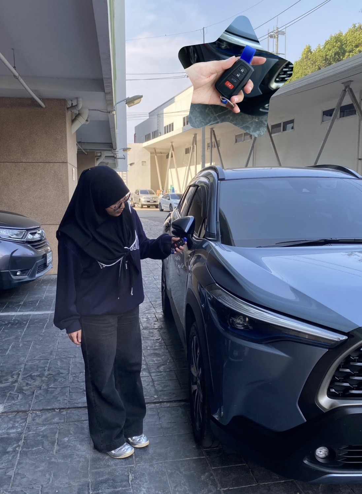

# ⋅˚₊‧ ୨  Security Control  ୧ ‧₊˚ ⋅

## Type of Security Controls 🪄
- Physical Control

## Control Functions 🧩
- Preventative

## Location 📍
- my car 🚗

# Why car key is Physical preventive ?
เพราะกุญแจรถยนต์เป็นสิ่งที่บ่งบอกว่าเราเป็นเจ้าของรถยนต์ ดังนั้นแล้วก็เหมือนกับ
Physical Control แบบ Preventive เพราะว่าหากไม่มีกุญแจรถก็ไม่สามารถที่จะใช้รถยนต์ได้

 [↩️ Back to profile](README.md)
